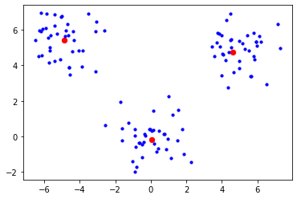

# BanditPAM: Almost Linear-Time *k*-Medoids Clustering

This repo contains a high-performance implementation of BanditPAM from [BanditPAM: Almost Linear-Time k-Medoids Clustering](https://proceedings.neurips.cc/paper/2020/file/73b817090081cef1bca77232f4532c5d-Paper.pdf). The code can be called directly from Python or C++.

If you use this software, please cite:

Mo Tiwari, Martin Jinye Zhang, James Mayclin, Sebastian Thrun, Chris Piech, Ilan Shomorony. "BanditPAM: Almost Linear Time *k*-medoids Clustering via Multi-Armed Bandits" Advances in Neural Information Processing Systems (NeurIPS) 2020.

```python
@inproceedings{BanditPAM,
  title={BanditPAM: Almost Linear Time k-medoids Clustering via Multi-Armed Bandits},
  author={Tiwari, Mo and Zhang, Martin J and Mayclin, James and Thrun, Sebastian and Piech, Chris and Shomorony, Ilan},
  booktitle={Advances in Neural Information Processing Systems},
  pages={368--374},
  year={2020}
}
```

# Requirements
# TL;DR run `pip install banditpam` and jump to the [examples](https://github.com/ThrunGroup/BanditPAM#example-1-synthetic-data-from-a-gaussian-mixture-model). 

If you have any difficulties, please see the [platform-specific guides](https://github.com/ThrunGroup/BanditPAM#platform-specific-installation-guides) and file a Github issue if you have additional trouble.

## Further Reading
* [Full paper](https://proceedings.neurips.cc/paper/2020/file/73b817090081cef1bca77232f4532c5d-Paper.pdf)
* [3-minute summary video](https://crossminds.ai/video/bandit-pam-almost-linear-time-k-medoids-clustering-via-multi-armed-bandits-5fb88782b0a3f6412973b646/)
* [Blog post](https://ai.stanford.edu/blog/banditpam/)
* [Code](https://github.com/ThrunGroup/BanditPAM)
* [PyPI](https://pypi.org/project/banditpam/)
* [Documentation](https://banditpam.readthedocs.io/en/latest)

# Python Quickstart

## Install the repo and its dependencies:
This can be done either through PyPI (recommended)
```python
/BanditPAM/: pip install -r requirements.txt
/BanditPAM/: pip install banditpam
```
OR through the source code via
```python
/BanditPAM/: git submodule update --init --recursive
/BanditPAM/: cd headers/carma
/BanditPAM/: mkdir build && cd build && cmake -DCARMA_INSTALL_LIB=ON .. && sudo cmake --build . --config Release --target install
/BanditPAM/: cd ../../..
/BanditPAM/: pip install -r requirements.txt
/BanditPAM/: sudo pip install .
```

### Example 1: Synthetic data from a Gaussian Mixture Model

```python
from banditpam import KMedoids
import numpy as np
import matplotlib.pyplot as plt

# Generate data from a Gaussian Mixture Model with the given means:
np.random.seed(0)
n_per_cluster = 40
means = np.array([[0,0], [-5,5], [5,5]])
X = np.vstack([np.random.randn(n_per_cluster, 2) + mu for mu in means])

# Fit the data with BanditPAM:
kmed = KMedoids(n_medoids=3, algorithm="BanditPAM")
kmed.fit(X, 'L2')

print(kmed.labels) # prints cluster assignments [0] * 40 + [1] * 40 + [2] * 40

# Visualize the data and the medoids:
for p_idx, point in enumerate(X):
    if p_idx in map(int, kmed.medoids):
        plt.scatter(X[p_idx, 0], X[p_idx, 1], color='red', s = 40)
    else:
        plt.scatter(X[p_idx, 0], X[p_idx, 1], color='blue', s = 10)

plt.show()
```



### Example 2: MNIST and its medoids visualized via t-SNE

```python
# Start in the repository root directory, i.e. '/BanditPAM/'.
from banditpam import KMedoids
import numpy as np
import pandas as pd
import matplotlib.pyplot as plt
from sklearn.manifold import TSNE

# Load the 1000-point subset of MNIST and calculate its t-SNE embeddings for visualization:
X = pd.read_csv('data/MNIST_1k.csv', sep=' ', header=None).to_numpy()
X_tsne = TSNE(n_components=2).fit_transform(X)

# Fit the data with BanditPAM:
kmed = KMedoids(n_medoids=10, algorithm="BanditPAM")
kmed.fit(X, 'L2')

# Visualize the data and the medoids via t-SNE:
for p_idx, point in enumerate(X):
    if p_idx in map(int, kmed.medoids):
        plt.scatter(X_tsne[p_idx, 0], X_tsne[p_idx, 1], color='red', s = 40)
    else:
        plt.scatter(X_tsne[p_idx, 0], X_tsne[p_idx, 1], color='blue', s = 5)

plt.show()
```

## Documentation

Documentation for BanditPAM can be found on [read the docs](https://banditpam.readthedocs.io/en)

## Building the C++ executable from source

Please note that it is *NOT* necessary to build the C++ executable from source to use the Python code above. However, if you would like to use the C++ executable directly, follow the instructions below.

### Option 1: Building with Docker

We highly recommend building using Docker. One can download and install Docker by following instructions at the [Docker install page](https://docs.docker.com/get-docker/). Once you have Docker installed and the Docker Daemon is running, run the following commands:

```
/BanditPAM/scripts/docker$ chmod +x env_setup.sh
/BanditPAM/scripts/docker$ ./env_setup.sh
/BanditPAM/scripts/docker$ ./run_docker.sh
```

which will start a Docker instance with the necessary dependencies. Then:

```
/BanditPAM$ mkdir build && cd build
/BanditPAM/build$ cmake .. && make
```

This will create an executable named `BanditPAM` in `BanditPAM/build/src`.

### Option 2: Installing requirements and building directly
Building this repository requires four external requirements:
* [CMake](https://cmake.org/download/) >= 3.17
* [Armadillo](http://arma.sourceforge.net/download.html) >= 10.5.3 
* [OpenMP](https://www.openmp.org/resources/openmp-compilers-tools/) >= 2.5 (OpenMP is supported by default on most Linux platforms, and can be downloaded through [homebrew](https://brew.sh/) on MacOS)
* [CARMA](https://github.com/RUrlus/carma) >= 0.6.2

If installing these requirements from source, one can generally use the following procedure to install each requirement from the library's root folder (with `armadillo` used as an example here):
```
/armadillo$ mkdir build && cd build
/armadillo/build$ cmake .. && make && sudo make install
```

Note that `CARMA` has different installation instructions; see the [quickstart](https://github.com/ThrunGroup/BanditPAM#install-the-repo-and-its-dependencies).

####  Platform-specific installation guides
Further installation information for [MacOS](docs/install_mac.md), [Linux](docs/install_linux.md), and [Windows](docs/install_windows.md) is available in the [docs folder](docs). Ensure all the requirements above are installed and then run:

```
/BanditPAM$ mkdir build && cd build
/BanditPAM/build$ cmake .. && make
```

This will create an executable named `BanditPAM` in `BanditPAM/build/src`.

## C++ Usage

Once the executable has been built, it can be invoked with:
```
/BanditPAM/build/src/BanditPAM -f [path/to/input.csv] -k [number of clusters]
```

* `-f` is mandatory and specifies the path to the dataset
* `-k` is mandatory and specifies the number of clusters with which to fit the data

For example, if you ran `./env_setup.sh` and downloaded the MNIST dataset, you could run:

```
/BanditPAM/build/src/BanditPAM -f ../data/MNIST_1k.csv -k 10
```

The expected output in the command line will be:
```
Medoids: 694,168,306,714,324,959,527,251,800,737
```

## Implementing a custom distance metric

One of the advantages of k-medoids is that it works with arbitrary distance metrics; in fact, your "metric" need not even be a real metric -- it can be negative, asymmetric, and/or not satisfy the triangle inequality or homogeneity. Any pairwise dissimilarity function works with k-medoids!

This also allows for clustering of "exotic" objects like trees, graphs, natural language, and more -- settings where running k-means wouldn't even make sense. We talk about one such setting in the [full paper](https://proceedings.neurips.cc/paper/2020/file/73b817090081cef1bca77232f4532c5d-Paper.pdf).

The package currently supports a number of distance metrics, including all Lp losses and cosine distance.

If you're willing to write a little C++, you only need to add a few lines to [kmedoids_algorithm.cpp](https://github.com/ThrunGroup/BanditPAM/blob/main/src/kmedoids_algorithm.cpp#L560-L615) and [kmedoids_algorithm.hpp](https://github.com/ThrunGroup/BanditPAM/blob/main/headers/kmedoids_algorithm.hpp#L136-L142) to implement your distance metric / pairwise dissimilarity!

Then, be sure to re-install the repository with a `pip install .` (note the trailing `.`).

The maintainers of this repository are working on permitting arbitrary dissimilarity metrics that users write in Python, as well; see [#4](https://github.com/ThrunGroup/BanditPAM/issues/4).

## Testing

To run the full suite of tests, run in the root directory:

```
/BanditPAM$ python -m unittest discover -s tests
```

Alternatively, to run a "smaller" set of tests, from the main repo folder run `python tests/test_smaller.py` or `python tests/test_larger.py` to run a set of longer, more intensive tests.
## Credits

Mo Tiwari wrote the original Python implementation of BanditPAM and many features of the C++ implementation. Mo now maintains the C++ implementation.

James Mayclin developed the initial C++ implementation of BanditPAM.

The original BanditPAM paper was published by Mo Tiwari, Martin Jinye Zhang, James Mayclin, Sebastian Thrun, Chris Piech, and Ilan Shomorony.

We would like to thank Jerry Quinn, David Durst, Geet Sethi, and Max Horton for helpful guidance regarding the C++ implementation.
