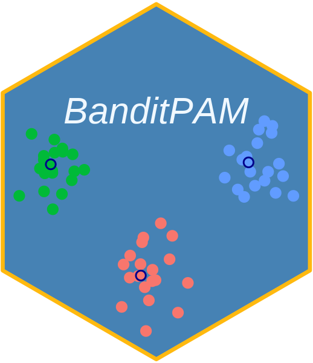

# BanditPAM 

This repo contains a high-performance implementation of
[BanditPAM](https://proceedings.neurips.cc/paper/2020/file/73b817090081cef1bca77232f4532c5d-Paper.pdf)
in R.

If you use this software, please cite:

Mo Tiwari, Martin Jinye Zhang, James Mayclin, Sebastian Thrun, Chris Piech, Ilan Shomorony. "BanditPAM: Almost Linear Time *k*-medoids Clustering via Multi-Armed Bandits" Advances in Neural Information Processing Systems (NeurIPS) 2020.

```
@inproceedings{BanditPAM,
  title={BanditPAM: Almost Linear Time k-medoids Clustering via Multi-Armed Bandits},
  author={Tiwari, Mo and Zhang, Martin J and Mayclin, James and Thrun, Sebastian and Piech, Chris and Shomorony, Ilan},
  booktitle={Advances in Neural Information Processing Systems},
  pages={368--374},
  year={2020}
}
```

## Installation

Until it gets on CRAN, you can install the development version of
BanditPAM like so:

``` r
remotes::install_github("bnaras/BanditPAM")
```

For the latter, you need the package development toolchain for R
packages. Refer to [CRAN](https://cran.r-project.org).


## Example

This is a basic example which shows you how to solve a common problem:

``` r
library(BanditPAM)
## Generate data from a Gaussian Mixture Model with the given means:
set.seed(10)
n_per_cluster <- 40
means <- list(c(0, 0), c(-5, 5), c(5, 5))
X <- do.call(rbind, lapply(means, MASS::mvrnorm, n = n_per_cluster, Sigma = diag(2)))
## Create KMediods object
obj <- KMedoids$new(k = 3)
## Fit data
obj$fit(data = X, loss = "l2")
## Retrieve medoid indices
meds <- obj$get_medoids_final()
## Plot the results
plot(X[, 1], X[, 2])
points(X[meds, 1], X[meds, 2], col = "red", pch = 19)
```

